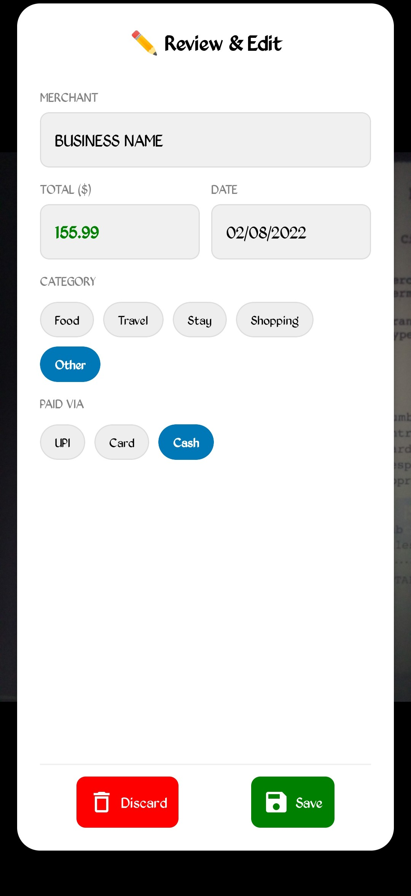

Parsr 🧾

Your AI-Powered Personal Expense Tracker
Parsr is a smart receipt scanner that uses on-device Machine Learning to turn physical receipts into digital data. Snap a photo, and Parsr automatically extracts the Merchant, Date, and Total amount, categorizes the expense, and visualizes your spending habits.

📸 Screenshots
| Camera Scan | AI Extraction | Analytics Dashboard |
|---|---|---|
|  |  |  |
> 
🚀 Key Features
 * 🧠 On-Device OCR: Uses Google ML Kit to instantly read text from images without needing an internet connection.
 * ⚡ Smart Parsing: Custom algorithms (Regex) automatically detect the Total Amount, Date, and Merchant Name from messy receipt text.
 * 🏷️ Auto-Categorization: Intelligently guesses categories (e.g., "Starbucks" -> "Food", "Uber" -> "Travel").
 * ✏️ Review & Edit: A clean interface to correct any AI mistakes and add payment methods (UPI, Card, Cash).
 * 📊 Visual Analytics: Beautiful Donut Charts breakdown your spending by category.
 * 💾 Local Storage: All data is saved securely on your device using AsyncStorage.
 
🛠️ Tech Stack
 * Framework: React Native (Expo)
 * Language: TypeScript
 * AI/ML: @react-native-ml-kit/text-recognition
 * Camera: expo-camera
 * Charts: react-native-gifted-charts
 * Storage: @react-native-async-storage
 * Icons: @expo/vector-icons

🏃‍♂️ Getting Started

1. Clone the Repository
git clone https://github.com/your-username/parsr.git
cd parsr

2. Install Dependencies
npm install

3. Build the Native App (Crucial!)
Since this app uses Native ML Kit libraries, it will not work in standard Expo Go. You must build a development client.
For Android:
npx expo run:android

For iOS (Mac only):
npx expo run:ios

4. Run the App
Once the build finishes and the app installs on your device/emulator:
npx expo start --dev-client

🧩 How It Works
 * Capture: The user takes a photo of a receipt.
 * Process: The image is passed to the ML Kit Text Recognizer.
 * Parse: The raw text block is sent to src/utils/parser.ts, which uses Regular Expressions to hunt for patterns (dates MM/DD/YYYY, prices $xx.xx, and keywords like "Total").
 * Categorize: The merchant name is checked against a keyword list to auto-assign a category.
 * Visualize: The data is saved and aggregated into the Analytics Dashboard.

🔮 Future Roadmap
 * [ ] Cloud Sync: Sync data to Firebase/Supabase for cross-device access.
 * [ ] Export: Download monthly reports as PDF or CSV.
 * [ ] Budget Goals: Set monthly limits for specific categories (e.g., "Stop me if I spend > $200 on Coffee").

Built with ❤️ by Vignesh

